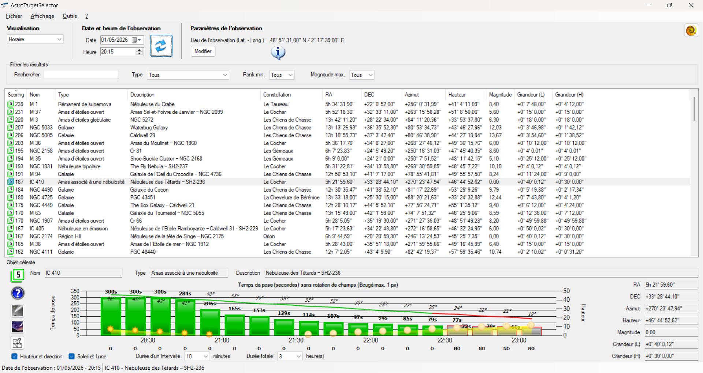
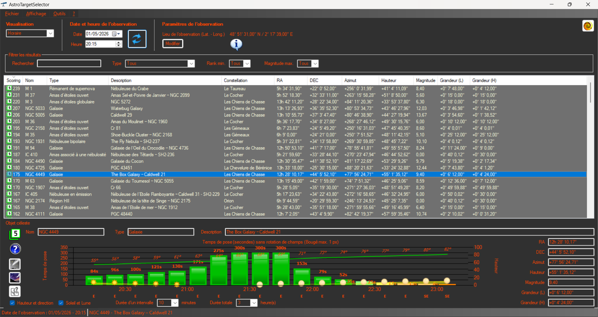
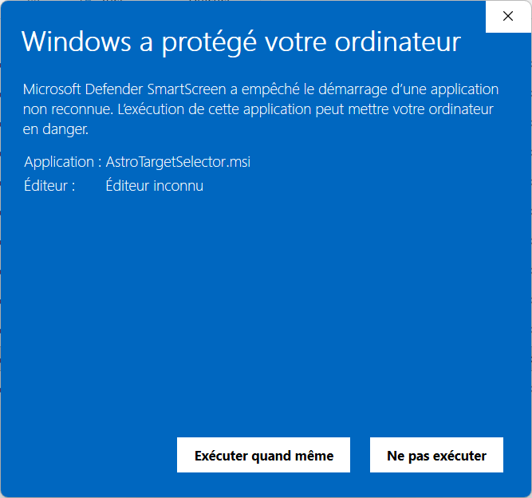
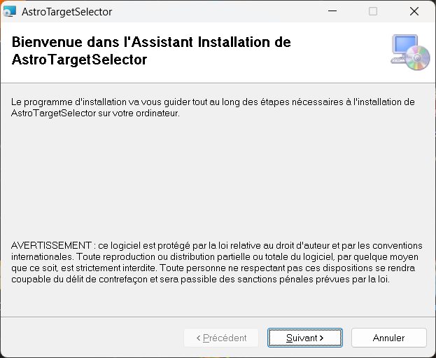
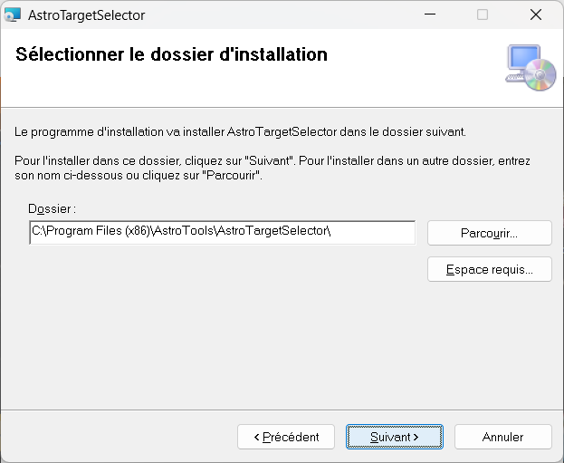
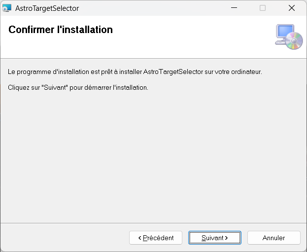
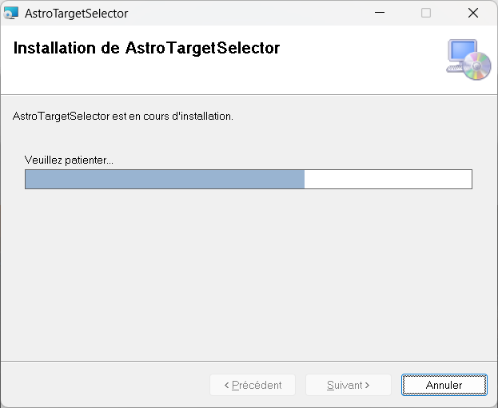
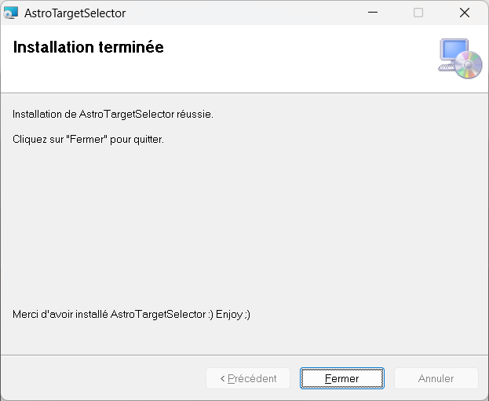

# Bienvenue sur la page Github de AstroTargetSelector (ATS)
Utilitaire permettant le calcul du temps de pose maximum sans rotation de champ pour les montures astronomiques de type Alt./Az.

## Principe 

Vous le savez certainement, le temps de pose avec une monture Alt-Azimutale est limité par la rotation de champ.

Or, la rotation de champ n'est pas homogène sur la voute céleste, elle varie en fonction des coordonnées Alt-Az.

Des équations permettent de déterminer le temps de pose maximum en fonction de ces coordonnées et du capteur utilisé pour réaliser la photo. Etant donné que l'on va s'intéresser à des montures équipées d'un système de suivi sidéral (goto), la focale n'entre plus en compte dans le calcul.

## Fonctionnement d'ATS

ATS va considérer votre lieu d'observation, la date, le capteur de l'imageur et à partir de cela, va vous donner l'évolution du temps de pose sur la soirée (mais pas que). Les objets sont notés du meilleur temps au plus mauvais.

Plus besoin de perdre de longues minutes à chercher le bon temps de pose pour l'objet que vous souhaitez photographier, plus besoin de vous demander quel objet photographier ce soir, ATS se charge de cela pour vous.

Vous allez même vous apercevoir qu'il est tout à fait possible de dépasser les fameuses "30s de temps de pose max" dans de nombreuses situations. La limite sera alors celle de la qualité du suivi sidéral offert par votre monture.

## Installation d'ATS

Pour installer ***AstroTargetSelector*** sur votre PC, téléchargez et lancez le fichier **AstroTargetSelector.msi**.

### Confirmation de l'éditeur

Lors de l'exécution de **AstroTargetSelector.msi** sur votre PC, l'écran de ***Microsoft Defender SmartScreen*** apparait. Vous pouvez cliquer sur ***Exécuter quand même*** afin de lancer l'installeur.

### Assistant d'installation d'ATS
Afin d'installer le logiciel ATS, veuillez suivre les étapes de l'assistant.

\

<b>Enjoy ;)</b>

<b><i>Juanito del Pepito</i></b>

