# Bienvenue sur la page Github de AstroTargetSelector (ATS)
Utilitaire permettant le calcul du temps de pose maximum sans rotation de champ pour les montures astronomiques de type Alt./Az.

***AstroTargetSelector*** (**ATS**) est un freeware disponible sous ***Windows*** et sous ***Android***.

Disponible en FR et EN.

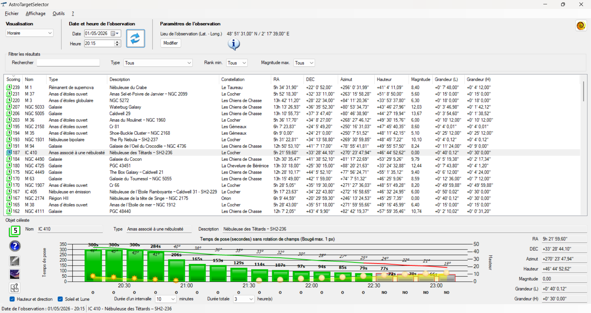
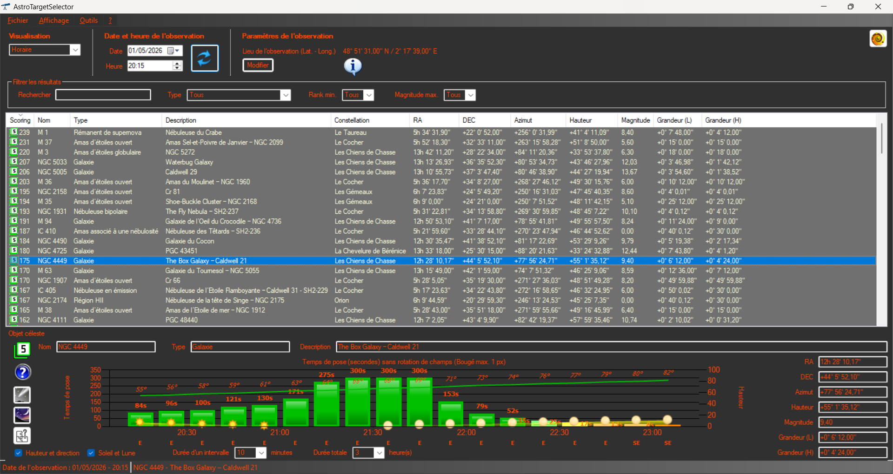
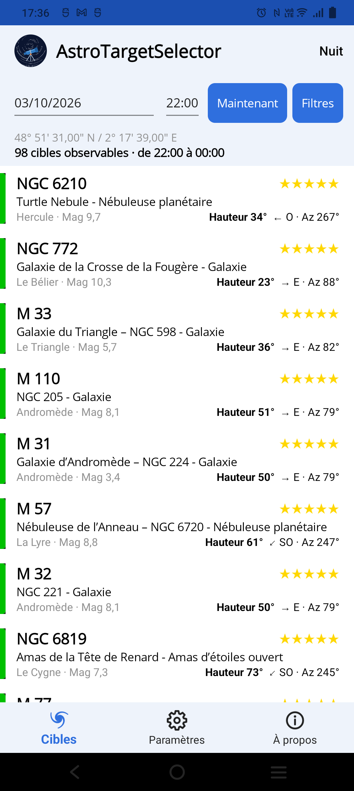
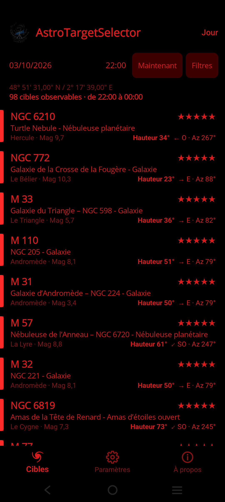

## Sommaire
- [Principe](#principe)
- [Fonctionnement d'ATS](#fonctionnement-dats)
- [Installation](#installation)
    - [PC (Windows)](#pc-windows)
    - [Mobile (Android)](#mobile-android)
- [Utilisation](#utilisation)
    - [Application Windows](#application-windows)
        - [Menu](#menu)
            - [Menu Fichier](#menu-fichier)
            - [Menu Affichage](#menu-affichage)
            - [Menu Outils](#menu-outils)
            - [Menu ?](#menu-)
        - [Zone de saisie](#zone-de-saisie)
            - [Visualisation](#visualisation)
            - [Date et heure de l'observation](#date-et-heure-de-lobservation)
            - [Paramètres de l'observation](#paramètres-de-lobservation)
        - [Filtres](#filtres)
        - [Liste des objets célestes](#liste-des-objets-célestes)
        - [Panneau objet céleste](#panneau-objet-céleste)
            - [Graphe du temps de pose](#graphe-du-temps-de-pose)
            - [Modes de visualisation](#modes-de-visualisation)
        - [Boîte de dialogue Paramètres](#boîte-de-dialogue-paramètres)
        - [Boîte de dialogue Options](#boîte-de-dialogue-options)
        - [Mosaic Calculator](#mosaic-calculator)
        - [Mise à jour des catalogues](#mise-à-jour-des-catalogues)
        - [Mode nuit](#mode-nuit)
        - [Barre de statut](#barre-de-statut)
        - [Boîte de dialogue A propos](#boîte-de-dialogue-a-propos)
    - [Application Mobile](#application-mobile)
        - [Onglet Cibles](#onglet-cibles)
        - [Filtres de la liste](#filtres-de-la-liste)
        - [Détail d'une cible](#détail-dune-cible)
        - [Onglet Paramètres](#onglet-paramètres)
        - [Mode nuit sur mobile](#mode-nuit-sur-mobile)
        - [Onglet A propos](#onglet-a-propos)
- [Révisions](#révisions)

## Principe

Vous le savez certainement, le temps de pose avec une monture Alt-Azimutale est limité par la rotation de champ.

Or, la rotation de champ n'est pas homogène sur la voute céleste, elle varie en fonction des coordonnées Alt-Az.

Des équations permettent de déterminer le temps de pose maximum en fonction de ces coordonnées et du capteur utilisé pour réaliser la photo. Etant donné que l'on va s'intéresser à des montures équipées d'un système de suivi sidéral (goto), la focale n'entre plus en compte dans le calcul.

<a href="#sommaire">Retour au sommaire</a>

## Fonctionnement d'ATS

ATS va considérer votre lieu d'observation, la date, le capteur de l'imageur et à partir de cela, va vous donner l'évolution du temps de pose sur la soirée (mais pas que). Les objets sont notés du meilleur temps au plus mauvais.

Plus besoin de perdre de longues minutes à chercher le bon temps de pose pour l'objet que vous souhaitez photographier, plus besoin de vous demander quel objet photographier ce soir, ATS se charge de cela pour vous.

Vous allez même vous apercevoir qu'il est tout à fait possible de dépasser les fameuses "30s de temps de pose max" dans de nombreuses situations. La limite sera alors celle de la qualité du suivi sidéral offert par votre monture.

<a href="#sommaire">Retour au sommaire</a>

## Installation

***AstroTargetSelector*** est disponible en deux versions :
- Une **application Windows**, complète.
- Une **application mobile Android**, allégée : sélection des cibles, graphes de visibilité, Lune et Soleil, mode nuit. Les fonctions liées au PC (pilotage de la monture, logiciels de cartographie, Mosaic Calculator) restent dans la version Windows.

<a href="#sommaire">Retour au sommaire</a>

### PC (Windows)

Pour installer ***AstroTargetSelector*** sur votre PC, téléchargez et lancez le fichier **[AstroTargetSelector_2016.msi](https://github.com/Juani005999/AstroTargetSelector/raw/main/AstroTargetSelector_2016.msi)**.

> [!NOTE]
> Une installation précédente n'a pas besoin d'être désinstallée : l'installeur la remplace automatiquement, et vos paramètres sont conservés.\
> Au démarrage, ***ATS*** vérifie si une nouvelle version est disponible et vous propose de la télécharger.

#### Confirmation de l'éditeur
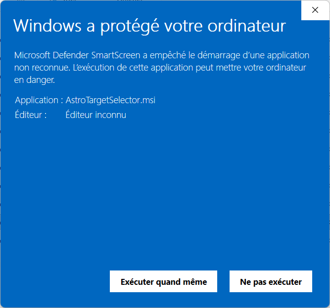

Lors de l'exécution de **AstroTargetSelector_2016.msi** sur votre PC, l'écran de ***Microsoft Defender SmartScreen*** apparait. Vous pouvez cliquer sur ***Exécuter quand même*** afin de lancer l'installeur.

#### Assistant d'installation d'ATS
Afin d'installer le logiciel ATS, veuillez suivre les étapes de l'assistant.

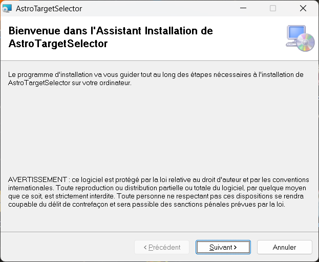
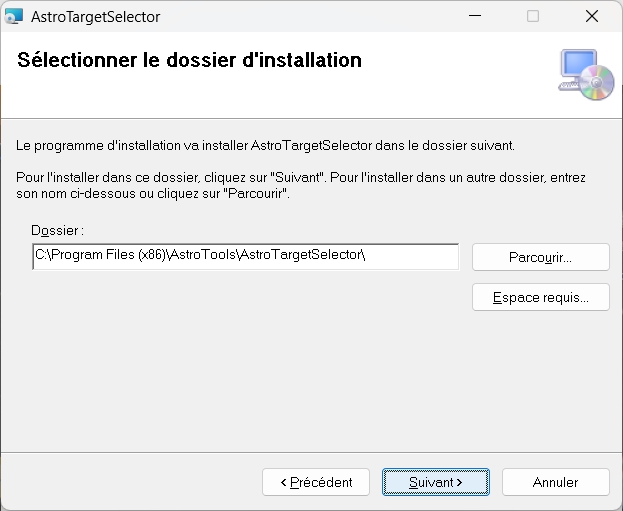
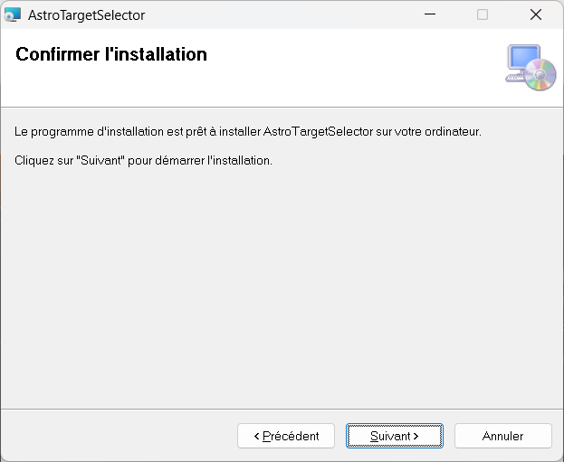
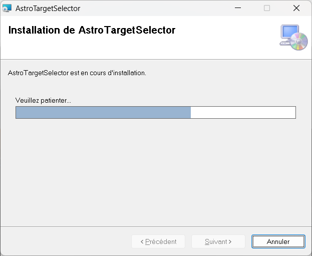
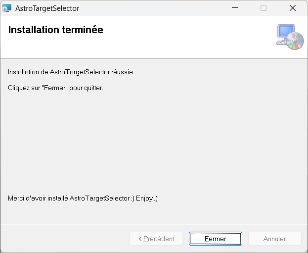

<a href="#sommaire">Retour au sommaire</a>

### Mobile (Android)

Prérequis : Android 7.0 ou plus récent, sur un téléphone 64 bits.

Pour installer ***AstroTargetSelector*** sur votre téléphone :
1. Depuis votre téléphone, téléchargez le fichier **[AstroTargetSelector_Android_2005.apk](https://github.com/Juani005999/AstroTargetSelector/raw/main/AstroTargetSelector_Android_2005.apk)**.
2. Ouvrez le fichier téléchargé. L'application n'étant pas distribuée par le Play Store, Android vous demande d'autoriser l'installation d'applications inconnues pour votre navigateur (ou votre gestionnaire de fichiers) : autorisez-la, puis revenez à l'installation.
3. Si ***Google Play Protect*** affiche un avertissement, choisissez ***Plus de détails***, puis ***Installer quand même***.

> [!NOTE]
> Pour mettre à jour l'application, téléchargez et installez simplement la nouvelle version : vos paramètres sont conservés.\
> L'application mobile ne vérifie pas elle-même la disponibilité d'une nouvelle version : consultez cette page et le tableau des [Révisions](#révisions).

<a href="#sommaire">Retour au sommaire</a>

## Utilisation

<a href="#sommaire">Retour au sommaire</a>

### Application Windows
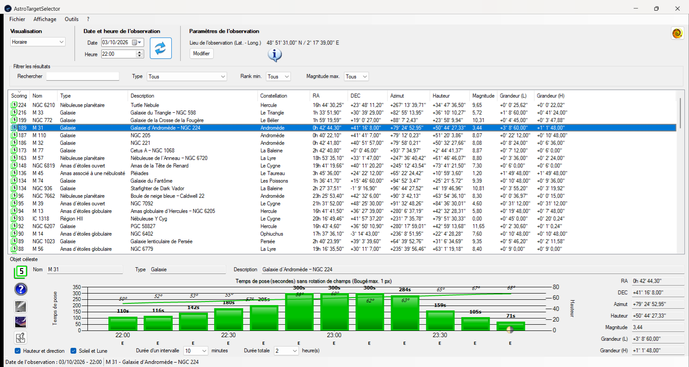

La fenêtre principale d'***ATS*** est composée :
- d'un [menu](#menu),
- d'une [zone de saisie](#zone-de-saisie) (mode de visualisation, date et heure, paramètres de l'observation),
- d'une zone de [filtres](#filtres),
- de la [liste des objets célestes](#liste-des-objets-célestes) observables,
- du [panneau de l'objet céleste](#panneau-objet-céleste) sélectionné, avec son graphe,
- d'une [barre de statut](#barre-de-statut).

<a href="#sommaire">Retour au sommaire</a>

#### Menu

<a href="#sommaire">Retour au sommaire</a>

##### Menu Fichier
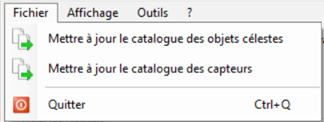

Le menu '***Fichier***' contient les éléments suivants :
- **Mettre à jour le catalogue des objets célestes**\
Télécharge la dernière version du catalogue des objets célestes (Cf. [Mise à jour des catalogues](#mise-à-jour-des-catalogues)).
- **Mettre à jour le catalogue des capteurs**\
Télécharge la dernière version du catalogue des capteurs.
- **Quitter** (***Ctrl+Q***)\
Permet de quitter l'application.

<a href="#sommaire">Retour au sommaire</a>

##### Menu Affichage
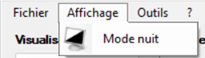

Le menu '***Affichage***' contient l'élément suivant :
- **Mode nuit**\
Active / désactive l'affichage en [mode nuit](#mode-nuit).

<a href="#sommaire">Retour au sommaire</a>

##### Menu Outils
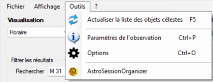

Le menu '***Outils***' contient les éléments suivants :
- **Actualiser la liste des objets célestes** (***F5***)\
Recalcule la liste des objets célestes et leurs temps de pose.
- **Paramètres de l'observation** (***Ctrl+P***)\
Ouvre la boîte de dialogue [Paramètres](#boîte-de-dialogue-paramètres).
- **Options** (***Ctrl+O***)\
Ouvre la boîte de dialogue [Options](#boîte-de-dialogue-options).
- **AstroSessionOrganizer**\
Lance l'application ***[AstroSessionOrganizer](https://github.com/Juani005999/AstroSessionOrganizer)*** (***ASO***), si elle est installée sur l'ordinateur.

<a href="#sommaire">Retour au sommaire</a>

##### Menu ?
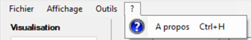

Le menu '***?***' contient l'élément suivant :
- **A propos** (***Ctrl+H***)\
Ouvre la boîte de dialogue [A propos](#boîte-de-dialogue-a-propos).

<a href="#sommaire">Retour au sommaire</a>

#### Zone de saisie
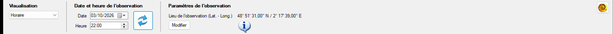

Cette zone permet de définir le mode de visualisation, la date et l'heure de l'observation, et d'accéder aux paramètres de l'observation.

> [!TIP]
> L'icône , en haut à droite de la fenêtre, est un raccourci vers l'application ***[AstroSessionOrganizer](https://github.com/Juani005999/AstroSessionOrganizer)***.

<a href="#sommaire">Retour au sommaire</a>

##### Visualisation
Le mode de visualisation définit la période sur laquelle les temps de pose sont calculés et affichés :
- **Horaire** : la soirée d'observation, à partir de la date et de l'heure saisies.
- **Nuits** : la nuit complète, de 19h à 4h.
- **Mensuel** : le mois à venir.
- **Annuel** : l'année à venir, mois par mois.

Le scoring et le classement des objets célestes dépendent du mode de visualisation sélectionné (Cf. [Modes de visualisation](#modes-de-visualisation)).

<a href="#sommaire">Retour au sommaire</a>

##### Date et heure de l'observation
La date et l'heure saisies définissent le début de la période de calcul.\
Le bouton  relance le calcul de la liste des objets célestes avec la date et l'heure saisies.

<a href="#sommaire">Retour au sommaire</a>

##### Paramètres de l'observation
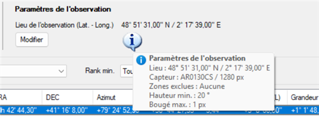

Cette partie affiche le lieu de l'observation (latitude et longitude).
- Le bouton **Modifier** ouvre la boîte de dialogue [Paramètres](#boîte-de-dialogue-paramètres).
- En passant la souris sur l'icône , une info-bulle résume l'ensemble des paramètres de l'observation : lieu, capteur, zones du ciel exclues, hauteur minimum et bougé max.

<a href="#sommaire">Retour au sommaire</a>

#### Filtres
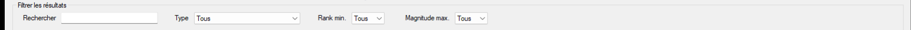

La zone '***Filtrer les résultats***' permet de restreindre la liste des objets célestes affichés :
- **Rechercher** : recherche dans le nom, la description et la constellation des objets (ex : *M 31*, *Andromède*, *Crabe*).
- **Type** : type d'objet céleste (galaxie, nébuleuse planétaire, amas d'étoiles ouvert...).
- **Rank min.** : rang minimum des objets affichés (de 1 à 5).
- **Magnitude max.** : magnitude maximum des objets affichés.

<a href="#sommaire">Retour au sommaire</a>

#### Liste des objets célestes
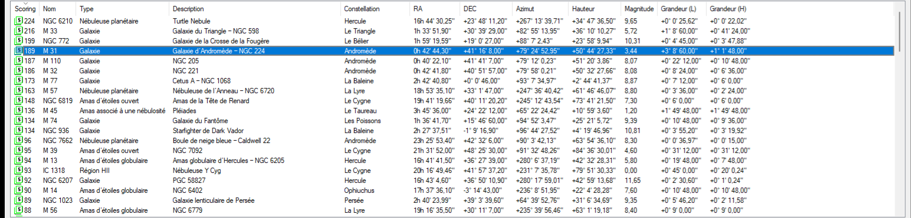

La liste affiche les objets célestes observables avec les paramètres actuels, triés par ***Scoring*** décroissant : les meilleures cibles du moment sont en tête de liste.

Pour chaque objet, la liste affiche :
- **Scoring** : moyenne des temps de pose maximum (en secondes) sur la période de calcul, précédée de l'icône du rang de l'objet :

| Rang | Scoring |
| --- | --- |
| 5 | supérieur à 50 s |
| 4 | de 31 à 50 s |
| 3 | de 21 à 30 s |
| 2 | de 11 à 20 s |
| 1 | 10 s ou moins |

- **Nom**, **Type**, **Description**, **Constellation**.
- **RA**, **DEC** : coordonnées équatoriales de l'objet.
- **Azimut**, **Hauteur** : position de l'objet à la date et à l'heure de l'observation.
- **Magnitude**, **Grandeur (L)**, **Grandeur (H)** : magnitude et dimensions apparentes de l'objet.

> [!NOTE]
> Un objet est considéré comme observable s'il est visible (au-dessus de la hauteur minimum et en dehors des zones du ciel exclues) sur au moins une partie de la période de calcul.

> [!TIP]
> La liste peut être triée par ordre croissant ou décroissant en cliquant sur un en-tête de colonne.

<a href="#sommaire">Retour au sommaire</a>

#### Panneau objet céleste
Lorsqu'un objet est sélectionné dans la liste, le panneau du bas affiche son détail :
- son rang, son nom, son type et sa description,
- ses coordonnées (RA, DEC), sa position (azimut, hauteur), sa magnitude et ses dimensions,
- le [graphe du temps de pose](#graphe-du-temps-de-pose) sur la période de calcul.

Les icônes à gauche du graphe permettent les actions suivantes :
-  : en passant la souris sur cette icône, une info-bulle explique la signification des intervalles grisés du graphe.

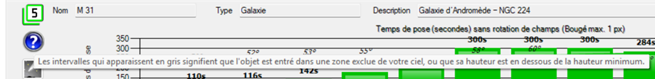

- 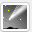 : affiche l'objet dans le logiciel ***Cartes du Ciel***.
- 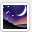 : affiche l'objet dans le logiciel ***Stellarium***.
-  : ouvre le [Mosaic Calculator](#mosaic-calculator) pour l'objet sélectionné.

<a href="#sommaire">Retour au sommaire</a>

##### Graphe du temps de pose
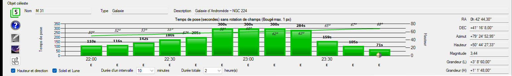

Le graphe affiche, pour chaque intervalle de la période de calcul :
- en **barres** : le temps de pose maximum sans rotation de champ (en secondes), dans la couleur du rang de l'intervalle,
- en **courbe** (option ***Hauteur et direction***) : la hauteur de l'objet (en degrés), et sa direction sous chaque intervalle (N, NE, E...),
- les courbes et icônes de la **Lune** et du **Soleil** (option ***Soleil et Lune***).

Les intervalles qui apparaissent en **gris** signifient que l'objet est entré dans une zone exclue de votre ciel, ou que sa hauteur est en dessous de la hauteur minimum.

En passant la souris sur un intervalle, une info-bulle affiche son détail : date et heure, temps de pose maximum, hauteur et azimut de l'objet, heures de lever et de coucher du Soleil, phase et horaires de la Lune.

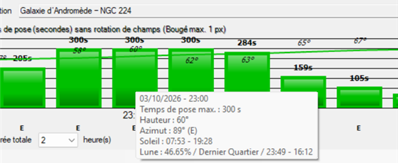

En mode ***Horaire***, les listes **Durée d'un intervalle** et **Durée totale** permettent d'ajuster le découpage de la soirée affichée dans le graphe.

<a href="#sommaire">Retour au sommaire</a>

##### Modes de visualisation
Le graphe s'adapte au mode de visualisation sélectionné :

**Horaire** : la soirée d'observation, intervalle par intervalle.

**Nuits** : la nuit complète, heure par heure, de 19h à 4h.

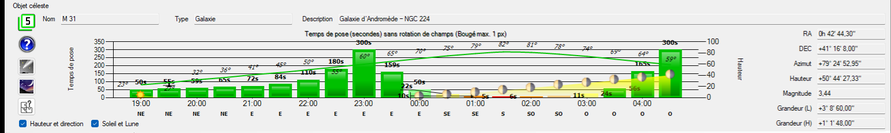

**Mensuel** : l'évolution sur le mois à venir. Idéal pour planifier les prochaines soirées.

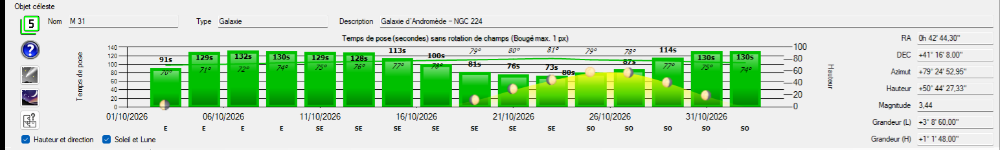

**Annuel** : l'évolution sur l'année à venir, mois par mois. Idéal pour connaître la meilleure saison d'observation d'un objet.

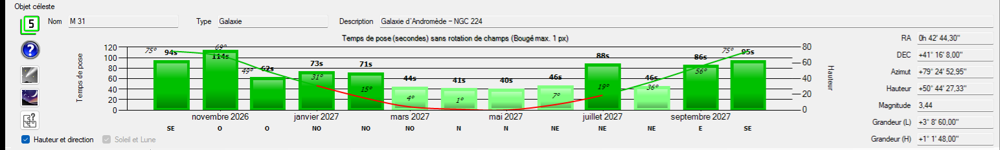

<a href="#sommaire">Retour au sommaire</a>

#### Boîte de dialogue Paramètres
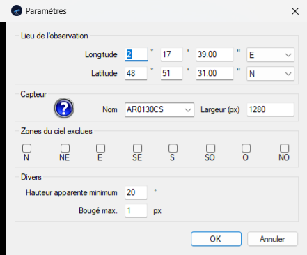

Cette boîte de dialogue, accessible par le menu ***Outils > Paramètres de l'observation*** ou le bouton **Modifier**, permet de définir les paramètres de l'observation :
- **Lieu de l'observation** : longitude et latitude, en degrés, minutes et secondes.
- **Capteur** : nom du capteur de votre caméra et sa largeur en pixels.\
Si votre capteur n'est pas présent dans la liste, vous pouvez saisir manuellement son nom et sa largeur en pixels.
- **Zones du ciel exclues** : directions masquées par un obstacle (immeuble, arbres, pollution lumineuse...). Les objets situés dans ces directions sont considérés comme non observables.
- **Hauteur apparente minimum** : hauteur en dessous de laquelle un objet est considéré comme non observable (20° par défaut).
- **Bougé max.** : déplacement maximum toléré, en pixels, dû à la rotation de champ pendant une pose (1 px par défaut).

<a href="#sommaire">Retour au sommaire</a>

#### Boîte de dialogue Options
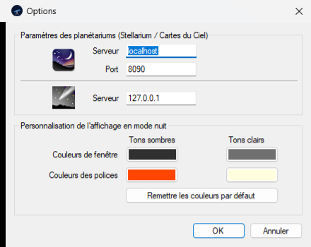

Cette boîte de dialogue, accessible par le menu ***Outils > Options***, permet de définir :
- **Paramètres des planétariums** : les options de communication avec les logiciels ***Stellarium*** (serveur et port du plugin de contrôle à distance, par défaut **localhost** / **8090**) et ***Cartes du Ciel*** (serveur, par défaut **127.0.0.1**).
- **Personnalisation de l'affichage en mode nuit** : couleurs de fenêtre et couleurs des polices (tons sombres et tons clairs) utilisées en [mode nuit](#mode-nuit). Le bouton **Remettre les couleurs par défaut** restaure les couleurs d'origine.

<a href="#sommaire">Retour au sommaire</a>

#### Mosaic Calculator
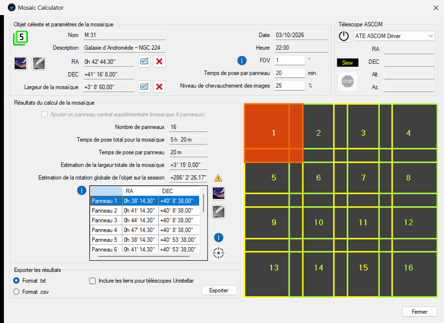

Le ***Mosaic Calculator*** vous permet de dépasser votre champ de vision en réalisant une mosaïque de l'objet sélectionné.

Paramètres de la mosaïque :
- **FOV** : le champ de vision de votre instrument, en degrés. L'icône d'information rappelle la formule permettant de le calculer.
- **Temps de pose par panneau**, en minutes.
- **Niveau de chevauchement des images**, en pourcentage.
- Les icônes à droite des champs **RA** et **Largeur de la mosaïque** permettent de modifier le centre et la taille de la mosaïque afin de la personnaliser.

Résultats du calcul :
- le nombre de panneaux, le temps de pose total et l'estimation de la largeur totale de la mosaïque,
- l'estimation de la rotation globale de l'objet sur la session (un avertissement s'affiche si elle est importante),
- la liste des panneaux avec leurs coordonnées, et leur représentation graphique à droite. Le panneau sélectionné est mis en évidence.
- pour les mosaïques à 4 panneaux, la possibilité d'ajouter un panneau central supplémentaire.

Actions possibles :
- afficher le panneau sélectionné ou la mosaïque complète dans ***Stellarium*** ou ***Cartes du Ciel***,
- **Télescope ASCOM** : connecter votre télescope ***ASCOM*** et l'orienter sur le panneau sélectionné (bouton ***Slew***),
- **Exporter les résultats** au format ***.txt*** ou ***.csv***, avec la possibilité d'inclure les liens pour télescopes ***Unistellar***.

<a href="#sommaire">Retour au sommaire</a>

#### Mise à jour des catalogues
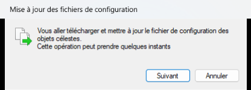

Les menus ***Fichier > Mettre à jour le catalogue...*** téléchargent la dernière version du catalogue des objets célestes ou du catalogue des capteurs. Cliquez sur **Suivant** pour lancer le téléchargement.

<a href="#sommaire">Retour au sommaire</a>

#### Mode nuit
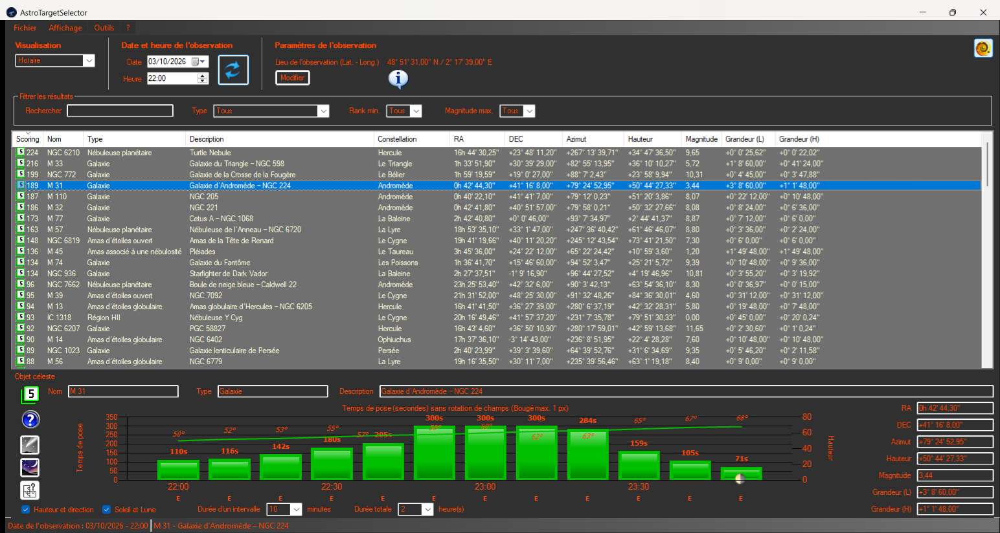

Le mode nuit, activé par le menu ***Affichage > Mode nuit***, affiche l'application dans des tons sombres pour préserver votre vision nocturne pendant vos observations.\
Les couleurs du mode nuit sont personnalisables dans la boîte de dialogue [Options](#boîte-de-dialogue-options).

<a href="#sommaire">Retour au sommaire</a>

#### Barre de statut
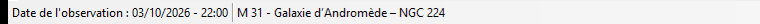

La barre de statut affiche la date et l'heure de l'observation, l'objet céleste sélectionné, et l'action en cours lors des calculs.

<a href="#sommaire">Retour au sommaire</a>

#### Boîte de dialogue A propos
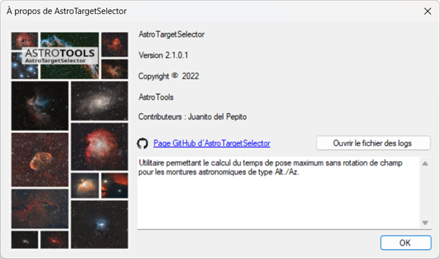

Cette boîte de dialogue affiche les informations à propos d'***AstroTargetSelector*** : version, auteur et description.\
Le lien **Page GitHub d'AstroTargetSelector** ouvre cette page dans votre navigateur : vous y trouverez les dernières versions (Windows et Android) et les nouveautés.\
Le bouton **Ouvrir le fichier des logs** permet d'ouvrir le fichier des logs de l'application.

<a href="#sommaire">Retour au sommaire</a>

### Application Mobile
L'application mobile est organisée en trois onglets : **Cibles**, **Paramètres** et **A propos**.\
Elle est disponible en français et en anglais, selon la langue de votre téléphone.

<a href="#sommaire">Retour au sommaire</a>

#### Onglet Cibles

L'onglet ***Cibles*** affiche la liste des cibles observables, triées de la meilleure à la moins bonne.

En haut de l'écran :
- la **date** et l'**heure** de l'observation, modifiables en les touchant,
- le bouton **Maintenant**, qui positionne la date et l'heure actuelles,
- le bouton **Filtres**, qui affiche ou masque les [filtres de la liste](#filtres-de-la-liste),
- le bouton **Nuit** / **Jour**, qui active ou désactive le [mode nuit](#mode-nuit-sur-mobile),
- le lieu d'observation et le nombre de cibles observables, avec la période de calcul (par exemple *de 22:00 à 00:00*).

Pour chaque cible, la liste affiche :
- son nom et son rang (de 1 à 5 étoiles), ainsi qu'une barre de couleur correspondant au rang,
- sa description et son type,
- sa constellation et sa magnitude,
- sa hauteur, sa direction et son azimut à la date et à l'heure de l'observation.

> [!NOTE]
> La liste mobile est toujours calculée sur une soirée de deux heures à partir de l'heure saisie (mode ***Horaire*** de la version Windows).

> [!TIP]
> Tirez la liste vers le bas pour la recalculer.\
> Touchez l'icône de l'application, en haut à gauche, pour ouvrir l'onglet ***A propos***.

Touchez une cible pour afficher son [détail](#détail-dune-cible).

<a href="#sommaire">Retour au sommaire</a>

#### Filtres de la liste
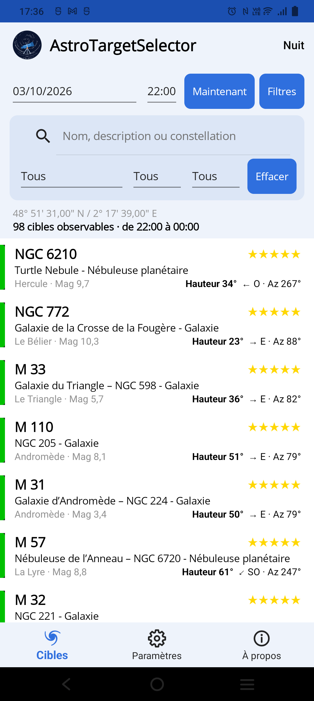

Les filtres permettent de restreindre la liste des cibles affichées :
- **recherche** dans le nom, la description ou la constellation,
- **type** de cible,
- **rang** minimum,
- **magnitude** maximum.

Le bouton **Effacer** réinitialise tous les filtres.

<a href="#sommaire">Retour au sommaire</a>

#### Détail d'une cible
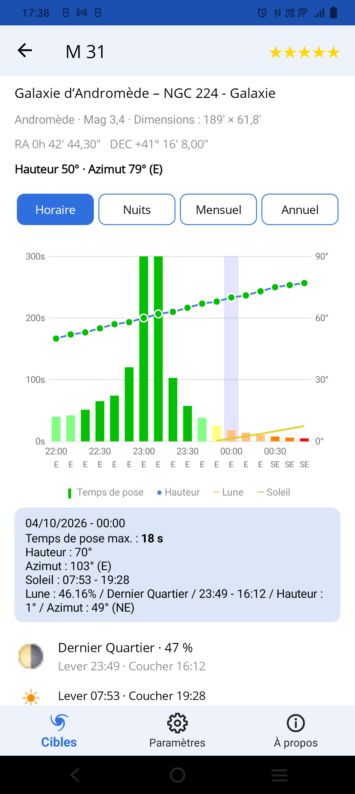

L'écran de détail affiche, sous le nom et le rang de la cible :
- sa description, sa constellation, sa magnitude et ses dimensions,
- ses coordonnées (RA, DEC),
- sa hauteur et son azimut à la date et à l'heure de l'observation,
- le graphe du temps de pose dans le mode de visualisation choisi : **Horaire**, **Nuits**, **Mensuel** ou **Annuel**.

Le graphe affiche le temps de pose maximum (barres), la hauteur de la cible (courbe), ainsi que la Lune et le Soleil selon le mode. Touchez un point du graphe pour afficher son détail sous le graphe : date et heure, temps de pose maximum, hauteur et azimut, Soleil et Lune.

En modes **Horaire** et **Nuits**, le bas de l'écran affiche la phase de la Lune et les heures de lever et de coucher de la Lune et du Soleil.

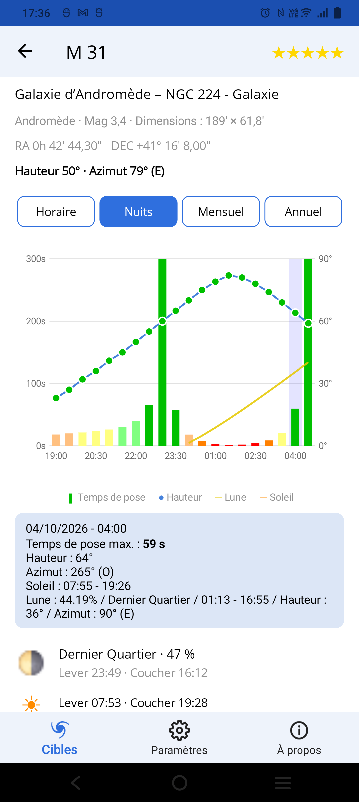
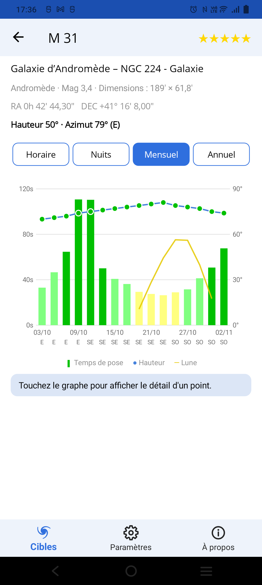
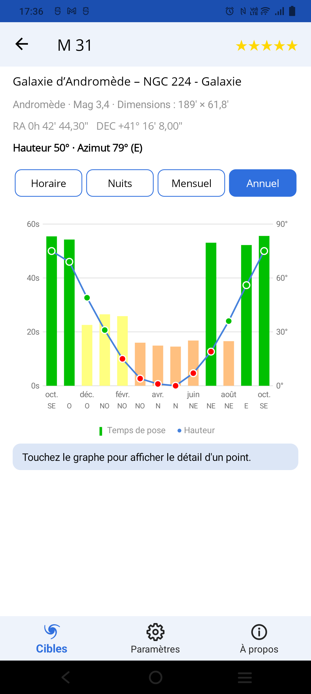

> [!TIP]
> Le mode de visualisation choisi est mémorisé pour les prochaines consultations.

<a href="#sommaire">Retour au sommaire</a>

#### Onglet Paramètres
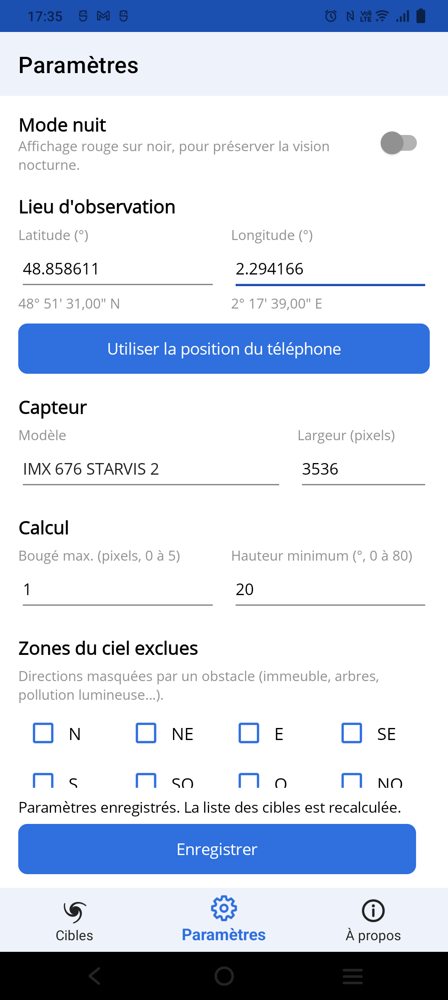

L'onglet ***Paramètres*** permet de définir :
- **Mode nuit** : active ou désactive le [mode nuit](#mode-nuit-sur-mobile).
- **Lieu d'observation** : latitude et longitude en degrés décimaux. La conversion en degrés, minutes et secondes s'affiche sous chaque valeur.\
Le bouton **Utiliser la position du téléphone** renseigne automatiquement le lieu à partir de la localisation du téléphone.
- **Capteur** : modèle du capteur et largeur en pixels. Si votre capteur n'est pas dans la liste, choisissez ***Autre capteur...*** et saisissez son nom et sa largeur.
- **Calcul** : bougé max. (en pixels) et hauteur minimum (en degrés).
- **Zones du ciel exclues** : directions masquées par un obstacle.
- **Soirée d'observation** : intervalle et durée utilisés par le graphe du mode ***Horaire*** de l'écran de détail.

Touchez **Enregistrer** pour valider les paramètres : la liste des cibles est alors recalculée.

<a href="#sommaire">Retour au sommaire</a>

#### Mode nuit sur mobile

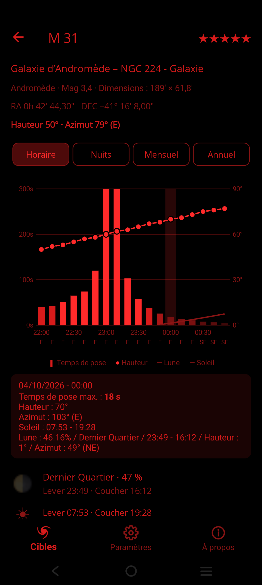

Le mode nuit affiche l'application en rouge sur noir, pour préserver votre vision nocturne pendant vos observations.\
Il s'active depuis le bouton **Nuit** de l'onglet ***Cibles***, ou depuis l'onglet ***Paramètres***.

<a href="#sommaire">Retour au sommaire</a>

#### Onglet A propos
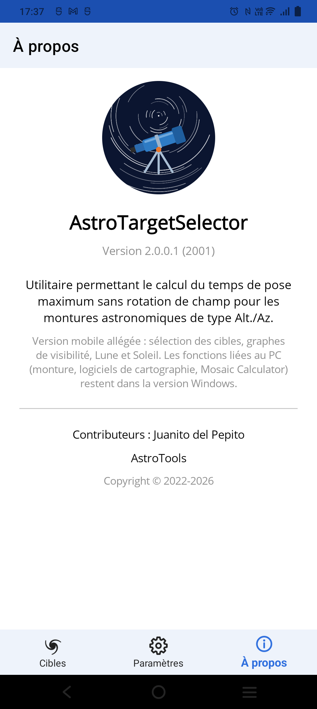

L'onglet ***A propos*** affiche la version de l'application, sa description et ses auteurs.\
Le bouton **Voir sur GitHub** ouvre cette page dans le navigateur du téléphone : vous y trouverez les dernières versions et les nouveautés.

<a href="#sommaire">Retour au sommaire</a>

<b>Enjoy ;)</b>

<b><i>Juanito del Pepito</i></b>

## Révisions

| Date | Version | Commentaires |
| --- | --- | --- |
| 04/10/2026 | 2.0.0.5 (Android) | <ul><li>Nouveautés : À propos : lien vers la page GitHub d’AstroTargetSelector (installeurs Windows et Android, nouveautés).</li></ul> |
| 04/10/2026 | 2.0.1.6 | <ul><li>Nouveautés : À propos : lien vers la page GitHub d’AstroTargetSelector (installeurs Windows et Android, nouveautés).</li><li>Corrections : Mode nuit : le lien de téléchargement de la fenêtre de nouvelle version suit désormais les couleurs du mode nuit.</li></ul> |
| 04/10/2026 | 2.0.0.4 (Android) | <ul><li>Corrections : Détail d’une cible : entre minuit et 2h du matin, les heures de lever et de coucher du Soleil et de la Lune étaient celles de la veille.</li></ul> |
| 04/10/2026 | 2.0.1.5 | <ul><li>Corrections : Graphe détail : entre minuit et 2h du matin, les heures de lever et de coucher du Soleil et de la Lune étaient celles de la veille.</li></ul> |
| 04/10/2026 | 2.0.1.4 | <ul><li>Corrections : Lune : les jours où la Lune ne se lève pas (ou ne se couche pas), les informations de la Lune sont de nouveau affichées, l’heure manquante étant remplacée par « — ».</li></ul> |
| 04/10/2026 | 2.0.1.3 | <ul><li>Maintenance : Vérification des mises à jour et téléchargement des fichiers de configuration (objets célestes, capteurs) désormais effectués depuis GitHub.</li></ul> |
| 03/10/2026 | 2.0.0.3 (Android) | <ul><li>L’application ne demande plus l’accès à Internet : elle fonctionne entièrement hors ligne, seule la localisation est demandée (facultative).</li></ul> |
| 03/10/2026 | 2.0.0.2 (Android) | <ul><li>Détail d’une cible : le graphe est recalculé lorsque les paramètres sont modifiés (capteur, bougé max., intervalle, durée…).</li><li>Paramètres : zone d’enregistrement mise en évidence.</li></ul> |
| 03/10/2026 | 2.0.1.2 | <ul><li>Nouvelle icône de l’application, commune avec la version mobile.</li><li>AstroTargetSelector est désormais disponible sur Android (voir Installation sur Android).</li><li>Hauteur minimum par défaut fixée à 20° (nouvelles installations).</li><li>Traduction anglaise : noms des phases de la Lune et libellés Lune / Soleil.</li></ul> |
| 03/10/2026 | 2.0.0.1 (Android) | <ul><li>Première version mobile pour Android : liste des cibles observables avec filtres, détail d’une cible avec graphes Horaire, Nuits, Mensuel et Annuel, Lune et Soleil.</li><li>Paramètres : lieu d’observation (saisie ou position GPS du téléphone), capteur (liste ou saisie d’un capteur personnalisé), bougé max., hauteur minimum, zones du ciel exclues.</li><li>Mode nuit rouge sur noir, en français et en anglais.</li></ul> |
| 27/09/2026 | 2.0.1.1 | <ul><li>Maintenance : Mise à jour des librairies techniques.</li><li>Maintenance : Amélioration des traces de la vérification des mises à jour.</li></ul> |
| 27/09/2026 | 2.0.1.0 | <ul><li>Nouvelle architecture : Refonte technique de l’application, en préparation d’une future version mobile (Android).</li><li>Paramètres : Vos paramètres (lieu d’observation, capteur, couleurs, options…) sont désormais conservés lors des mises à jour.</li><li>Vérification des mises à jour : La disponibilité d’une nouvelle version est de nouveau correctement détectée.</li><li>Barre des tâches : L’icône d’AstroTargetSelector s’affiche correctement lorsque l’application démarre en plein écran.</li><li>Traduction anglaise complétée.</li></ul> |
| 16/07/2026 | 1.8.0.1 | <ul><li>Mise à jour des Credentials FTP.</li></ul> |
| 16/07/2023 | 1.7.0.2 | <ul><li>Mosaic Calculator : Pilotage du télescope ASCOM et envoi des coordonnées des panneaux au télescope.</li><li>Mosaic Calculator : Possibilitté d’afficher la mosaïque complète dans Stellarium et Cartes du Ciel.</li></ul> |
| 09/03/2023 | 1.6.4.1 | <ul><li>Mosaic Calculator : Possibilité d’ajouter un panneau central supplémentaire pour les mosaïques à 4 panneaux.</li></ul> |
| 24/02/2023 | 1.6.3.2 | <ul><li>Mosaic Calculator : Possibilité de modifier le centre et la taille de la mosaïque afin de pouvoir la personnaliser.</li></ul> |
| 20/02/2023 | 1.6.1.2 | <ul><li>Mosaic Calculator : Correction de la valeur du ra dans les liens Unistellar.</li></ul> |
| 19/02/2023 | 1.6.1.1 | <ul><li>Nouvelle fonctionnalité : Le Mosaic Calculator. Dépassez votre champ de vision grâce au calculateur de mosaïque.</li></ul> |
| 18/02/2023 | 1.5.4.2 | <ul><li>Le Soleil à rendez-vous avec la Lune : Affichage du Soleil pour les modes Horaire et Nuit, et dans l’info-bulle pour le mode Mensuel.</li></ul> |
| 04/02/2023 | 1.5.3.1 | <ul><li>Icone la Lune : Correction des icones FirstQuarter et LastQuarter.</li><li>Infos bulle : Ajout de l’information Azimut de la Lune.</li><li>Options : Nouvelle boîte de dialogue Options.</li></ul> |
| 02/02/2023 | 1.5.2.1 | <ul><li>Bienvenue à la Lune : Affichage de la lune pour les modes Horaire, Nuit et Mensuel.</li></ul> |
| 29/01/2023 | 1.4.0.2 | <ul><li>Mode nuit custom colors : Personnalisation des couleurs d’affichage du mode nuit.</li></ul> |
| 24/01/2023 | 1.4.0.1 | <ul><li>TCP Server : Ajout des dénominations de l’objet lors de l’envoi de la commande.</li><li>Ouverture dans Stellarium : Mise en avant plan de Stellarium lors de l’affichage d’un objet.</li><li>Ouverture dans Carte du Ciel : Mise en avant plan de Carte du Ciel lors de l’affichage d’un objet.</li></ul> |
| 22/01/2023 | 1.3.0.1 | <ul><li>TCP Server : AstroTargetSelector a désormais la possibilité de recevoir des commandes depuis d’autre logiciels.</li></ul> |
| 30/08/2022 | 1.1.0.1 | <ul><li>Version initiale.</li></ul> |

<a href="#sommaire">Retour au sommaire</a>

